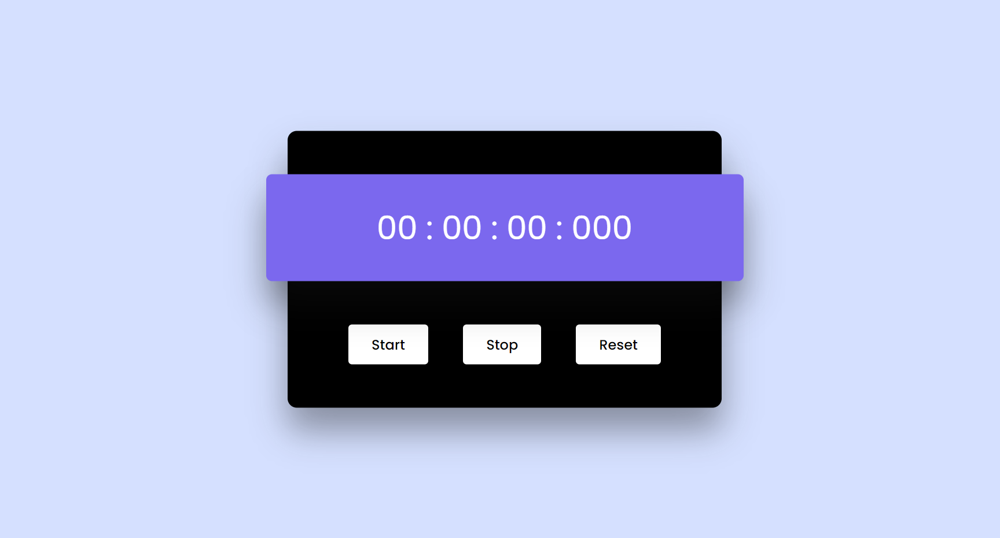

# Modern Stopwatch

Welcome to the Modern Stopwatch repository! This project is a JavaScript-based web application designed to function as a stopwatch. Built with HTML, CSS, and JavaScript, it provides a sleek and modern UI design with features to start, pause, and reset the timer.

## Preview

## Features

- **User-Friendly Interface:** Modern and intuitive design for ease of use.
- **Start, Pause, and Reset:** Control the stopwatch with convenient buttons.
- **Accurate Timing:** Precise tracking of elapsed time for various purposes.

## Usage

1. Click the "Start" button to initiate the stopwatch.
2. Press "Pause" to temporarily stop the timer.
3. Use the "Reset" button to clear and restart the stopwatch.

## Customization

Feel free to customize this project to fit your preferences. Update styles, colors, and layout in the HTML and CSS files. You can also extend the functionality to include additional features or customization options.

## Contributing

If you'd like to contribute to this project, please follow these steps:

1. Fork the repository.
2. Create a new branch for your feature or improvement.
3. Make your changes and commit them with descriptive messages.
4. Push your changes to your forked repository.
5. Open a pull request to merge your changes into the main branch.

Explore the Modern Stopwatch, time your activities with precision, and consider contributing to its development. Thank you for checking out the repository!